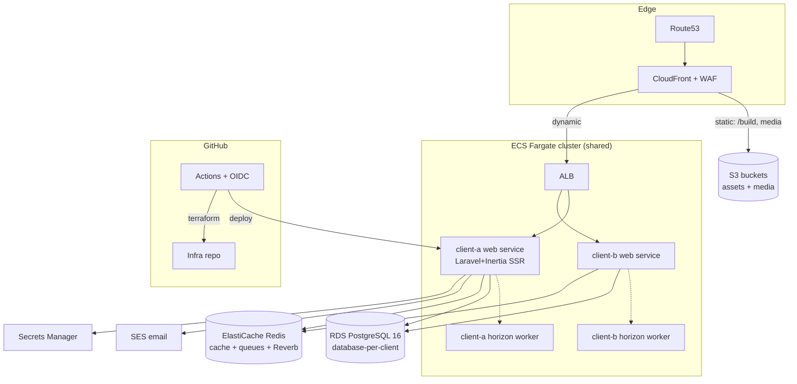

# Agency Platform Blueprint
**Supabase → Laravel platform migration & 5–10 year platform architecture**
*Prepared: June 2026 · Status: Proposed (3 decisions need founder sign-off, §0.3)*

---

## 0. Executive Summary & Stack Decision

### 0.1 The decision you asked me to make

You asked me to evaluate **Vue SPA + Laravel API** vs the **Inertia monolith** stack before committing. Verdict:

> **Adopt the Inertia monolith. Do not build a separate SPA + API.**

**Final stack:**

| Layer | Choice | Notes |
|---|---|---|
| Backend | **Laravel 12** | API-first *internally* (service layer), not API-first *over HTTP* |
| Admin | **Filament 4** (v4.2 stable since Nov 2025) | Agency ops center + client CMS dashboards |
| Frontend | **Inertia.js v2 + Vue 3 + TypeScript** | SSR enabled for marketing pages (SEO) |
| Styling | **Tailwind v4 + CSS-first design tokens** — *not SCSS* (see §0.2) | One styling system shared with Filament |
| Realtime | **Laravel Reverb** + Echo | Only where a site actually needs it |
| Queues | **Laravel Horizon** + Redis (ElastiCache) | SES mail, Stripe webhooks, media pipeline |
| Database | **RDS PostgreSQL 16** (db-per-client) → Aurora later | §2.4 for the Aurora trigger conditions |
| Storage/CDN | **S3 + CloudFront** + `spatie/laravel-medialibrary` | Replaces Supabase Storage |
| Auth | **Laravel session auth (Fortify) + Sanctum tokens** — *not Cognito/Passport* | §5.1 |
| Infra | **ECS Fargate (one shared cluster, service-per-client)** | §2.5 |
| CI/CD | **GitHub Actions + OIDC → AWS** | No long-lived AWS keys |
| Tenancy | **Hybrid: versioned core packages + app-per-client on shared infra** | §7 — the most consequential decision in this doc |

### 0.2 Where I'm challenging your assumptions

1. **Inertia over SPA+API — agreed, and here's the evidence.** The failure mode of SPA+API for an agency is well documented: every site becomes *two* deployables with auth/CORS/token-refresh plumbing, API versioning, duplicated validation, and twice the dependency-upgrade surface. Community consensus (r/laravel, r/vuejs, Laracasts, 2024–2026) is consistent: **build a separate API only when a non-browser consumer exists** (mobile app, third-party integrators). Your clients are content-heavy marketing/commerce sites — none have that requirement. Inertia v2 (polling, prefetch, deferred props, infinite scroll) plus first-party SSR closes the old gaps. If a client ever needs a mobile app, you add a versioned `/api/v1` *for that client* — the service layer (§2.2) makes controllers thin enough that this is additive, not a rewrite.

2. **SCSS is the wrong styling foundation — use Tailwind v4.** Three reasons: (a) **Filament 4 is Tailwind-native** — adopting SCSS means maintaining two styling systems in every project forever; (b) Tailwind v4's CSS-first `@theme` directive gives you exactly what you wanted SCSS for — design tokens, theming, white-labeling — as plain CSS custom properties that can even be swapped *per-tenant at runtime*; (c) your existing pilot codebase (GlowGirl) is already Tailwind v4. SCSS in 2026 buys you nesting and mixins that CSS/Tailwind already do. Keep a thin `tokens.css` layer; skip the preprocessor.

3. **"Vue" deserves one honest caveat.** Inertia is frontend-agnostic (Vue/React/Svelte). Your pilot codebase is **React 19** with ~40 well-built components. Porting it to Vue is a real one-time cost (~2–3 engineer-weeks). I still recommend **Vue 3 + TS** *if that's the standard you'll hold for a decade* (smaller API surface, SFC ergonomics, founder preference) — but the platform decision is Inertia either way, and React+Inertia would make the pilot migration ~40% cheaper. **Decide once, now, and never revisit.** This doc assumes Vue.

4. **Don't rebuild WordPress in Filament.** Filament is an admin framework, not a CMS. The winning move is a **lean, opinionated block-based content core** (§6.2): pages, blocks, media, SEO, menus, forms, redirects — and nothing else. Evaluated alternatives: Statamic (excellent, but per-site licensing, flat-file leanings, and it displaces Filament as your ops center) and headless CMSs (reintroduce the API-consumer split Inertia just removed). Build the lean core; it's ~3 weeks once and amortizes across every client.

### 0.3 Decisions requiring founder sign-off

| # | Decision | My recommendation |
|---|---|---|
| D1 | Inertia monolith vs SPA+API | Inertia |
| D2 | Vue 3 + TS (port pilot) vs React + TS (keep pilot components) | Vue, eyes open on port cost |
| D3 | Tailwind v4 tokens vs SCSS | Tailwind v4 |
| D4 | App-per-client on shared infra vs single multi-tenant app | App-per-client + versioned packages (§7) |

---

## Phase 1 — Audit of the Current Codebase (GlowGirl pilot)

### 1.1 Architecture assessment

```
React 19 + Vite 6 + TypeScript (strict) + Tailwind v4
React Router 7 (lazy routes, ErrorBoundary)   TanStack Query 5
Supabase JS v2 (Postgres + Auth + Edge Functions)
Stripe (Checkout via edge functions)          GitHub Pages (static SPA)
```

Recently hardened (June 2026): repo hygiene (11k → ~130 tracked files), route namespacing (`/shop/p/:slug`), code-splitting, CI (typecheck/lint/build), RLS hardening (`0003_rls_hardening.sql`), per-route SEO hook, virtual try-on POC.

**Honest grade: B for a single site, D as a platform.** It's a well-organized one-off. Nothing is reusable across clients without copy-paste; content is hardcoded in TSX (`site.ts`, `sections.tsx`) — a client cannot change a headline without a developer + deploy. That gap is precisely what this platform eliminates.

### 1.2 Supabase dependency map

| Supabase surface | Used by | Coupling |
|---|---|---|
| Postgres (8 tables: products, product_variants, orders, order_items, appointments, contact_messages, event_inquiries, newsletter_subscribers) | `useProducts`, checkout, booking, admin dashboard | **High** — supabase-js query syntax throughout hooks |
| Auth (email/password, single admin) | `/admin` route guard | Low — one user, one guard |
| RLS policies (3 migration files) | All data access control | **High** — entire authorization model lives in DB policies |
| Edge Functions ×6: `create-checkout-session`, `create-appointment-deposit`, `stripe-webhook`, `send-contact-notification`, `send-event-notification`, `send-newsletter-welcome` | Checkout, booking, transactional email (Resend) | Medium — Deno/TS, isolated, well-bounded |
| Storage | **Not used** (images are static `/public` assets) | None — lucky break |
| Realtime | **Not used** | None |

### 1.3 Risk & technical debt assessment

| Risk | Severity | Notes |
|---|---|---|
| Content hardcoded in components | High | Blocks the core business goal (client self-service) |
| Authorization logic = RLS only | High | Client-side admin guard; security entirely in DB policies. Laravel policies/gates replace this with testable app-layer auth |
| Static hosting (GH Pages) | Medium | No server = no SSR, no real redirects, SPA-hack 404 routing, no per-route OG tags for crawlers that skip JS |
| Stripe logic in Deno edge functions | Medium | Port to Cashier/Stripe-PHP — straightforward, ~6 small functions |
| No tests | Medium | Zero coverage; platform must mandate Pest tests in core packages |
| Single `.env`/keys committed historically | Low | Already remediated; rotate keys at cutover |

### 1.4 Migration complexity: **LOW — and this is the strategic insight.**
The production DB was never provisioned (no live data, no real users, no stored media). GlowGirl is therefore the **ideal pilot**: a full-fidelity feature set (e-commerce, booking, CMS-able content, admin) with a zero-risk data migration. Build the platform, rebuild GlowGirl on it, and the migration *is* the platform's acceptance test.

---

## Phase 2 — Target Architecture

### 2.1 System overview



### 2.2 Application architecture (every client app)

```
app/
├── Http/Controllers/        # thin: validate → call service → Inertia::render
├── Services/                # ALL business logic (Checkout, Booking, Newsletter…)
├── Actions/                 # single-purpose invokables (CreateOrder, ReserveSlot)
├── Events/ + Listeners/     # order placed → mail, webhooks → state transitions
├── Jobs/                    # queued work (mail, media conversions, syncs)
├── Models/                  # Eloquent + policies
├── Policies/                # replaces ALL Supabase RLS
└── Filament/                # client-specific admin resources only
resources/
├── js/
│   ├── Pages/               # Inertia pages (route-equivalent)
│   ├── Components/          # site-specific components
│   └── app.ts / ssr.ts
└── css/app.css              # imports platform tokens + tailwind
```

**Rules:** controllers never contain business logic; services never render; everything client-reusable graduates into a platform package (§6). Pest tests required on services/actions.

### 2.3 Service boundaries

| Boundary | Owner | Contract |
|---|---|---|
| Content (pages/blocks/media/SEO) | `platform/cms` package | Eloquent models + Filament resources + Vue block renderers |
| Commerce (products/cart/orders/Stripe) | `platform/commerce` package | Services + Cashier; sites opt in |
| Booking/appointments | `platform/booking` package | Opt-in |
| Forms/newsletter/contact | `platform/forms` package | Opt-in |
| Identity & permissions | `platform/core` (Fortify + spatie/permission) | Roles: `agency-admin`, `client-admin`, `client-editor` |
| Client-specific features (e.g. try-on) | client app repo | Stays out of platform until ≥2 clients need it |

### 2.4 Database: RDS PostgreSQL now, Aurora when earned

- **Start:** one `db.t4g.medium` RDS PostgreSQL 16, **one database per client**, one credential per client in Secrets Manager. Multi-AZ from the first paying client. Automated snapshots 30d + `pg_dump` nightly to S3 (cross-region copy).
- **Why not Aurora day 1:** at 5–20 brochure/commerce sites, Aurora's minimum spend (even Serverless v2 min-ACU) buys you nothing — these workloads are tiny. Aurora migration is a snapshot-restore away and changes zero application code.
- **Aurora triggers:** sustained read pressure needing replicas, a client with real traffic (>~500 req/s sustained), or storage autoscaling pain. Then move *that client* (or the fleet) to Aurora PostgreSQL.
- **Isolation note:** db-per-client (not schema-per-client) = clean per-client dumps, restores, deletions (GDPR), and per-client point-in-time recovery without blast radius.

### 2.5 Infrastructure decisions & justification

| Component | Decision | Why / why not the alternative |
|---|---|---|
| Compute | **ECS Fargate**, shared cluster, per-client service (web + worker), 0.25–0.5 vCPU tasks | EC2: you become a fleet sysadmin. Lambda (Vapor-style): cold starts on SSR, payload limits, harder Reverb/Horizon story. Fargate: no hosts to patch, per-client right-sizing, ~$15–30/client/mo at small scale |
| Ingress | One ALB, host-header routing per client | One ALB ($~20/mo) serves the whole fleet; cheaper + simpler than per-client |
| CDN/Edge | CloudFront in front of ALB + S3, WAF (managed rules: core, SQLi, IP reputation) on CloudFront | One distribution per client (cert via ACM) |
| Static assets | Vite `/build` synced to S3 at deploy, served via CloudFront | Don't serve assets through PHP |
| Email | **SES** (replace Resend) | In-VPC, cheap, one less vendor; keep Resend only if deliverability ever proves a problem |
| Cache/queue/realtime backbone | One ElastiCache Redis (small, logical-db-per-client) | Horizon requires Redis; also Reverb scaling + cache |
| Secrets | Secrets Manager, injected as ECS task env at deploy | Never in repo/CI variables |
| IaC | **Terraform** (infra repo, modules: `client-site`, `cluster`, `database`) | New client = one module instantiation + `terraform apply` |

**Pragmatism check (CTO note):** if standing up Terraform+ECS feels heavy for the first 60 days, **Laravel Forge on 1–2 EC2 boxes is an acceptable stepping stone** — but commit to ECS as the destination and don't let the stepping stone calcify. Do not adopt Vapor/Laravel Cloud if AWS-control is a strategic requirement (it is, per your brief).

### 2.6 Deployment architecture

- **Environments:** `production` + `staging` per client (staging on the same cluster, scaled to zero-ish: 1 tiny task, basic-auth gate). Local dev via Sail/Herd. No long-lived "dev" environment in AWS.
- **Deploy unit:** one Docker image per client app (PHP-FPM + Nginx sidecar or FrankenPHP single-container), tagged by git SHA, pushed to ECR.
- **Release:** ECS rolling deploy → `php artisan migrate --force` as a one-off pre-deploy task → health check `/up` → traffic shift. Rollback = redeploy previous image tag (migrations must be additive; destructive changes in a later release).

---

## Phase 3 — Migration Roadmap (executable phases)

> Effort assumes 2 senior engineers, part-time on this alongside client work. "ED" = engineer-days.

### M0 — Foundations (no client impact)
- **Objectives:** infra repo (Terraform: VPC, ECS cluster, RDS, Redis, ECR, OIDC role); platform monorepo scaffolded (§6.1); CI templates; Docker base image; coding standards (Pint, PHPStan lvl 6+, Pest, eslint/Prettier for Vue/TS).
- **Dependencies:** AWS account hygiene (org, billing alarms, IAM Identity Center).
- **Risks:** over-engineering Terraform. *Mitigation:* only the modules M1 needs.
- **Effort:** 8–12 ED. **Rollback:** n/a (greenfield). **Validation:** `terraform apply` from CI; "hello Laravel" container serving via CloudFront on a test domain.

### M1 — Platform core v0.1
- **Objectives:** `platform/core` (auth, roles, Filament panel shell, settings), `platform/cms` v0 (pages, block model, media via medialibrary→S3, SEO fields, redirects), `platform/forms` v0; starter template repo (`platform-template`) that boots a styled, CMS-managed site in <1 hour.
- **Dependencies:** M0; D1–D4 signed off.
- **Risks:** CMS scope creep. *Mitigation:* hard scope — pages/blocks/media/SEO/menus/forms/redirects, nothing else in v0.
- **Effort:** 20–30 ED. **Rollback:** packages are versioned; template pins versions. **Validation:** demo site built from template by the *other* founder in under a day without touching package code.

### M2 — GlowGirl rebuild on the platform (pilot)
- **Objectives:** new `glowgirl` app from template; port pages to CMS blocks + Inertia/Vue components; `platform/commerce` v0 (products/variants/cart/orders + Cashier Checkout) and `platform/booking` v0 extracted *from* this work; port try-on as client-specific code; Stripe webhooks via Cashier; SES mail; admin in Filament.
- **Dependencies:** M1. **Risks:** React→Vue port underestimated (≈40 components). *Mitigation:* port pages in CMS-block order, ship behind staging domain; timebox parity to "current site + CMS", not "current site + new features".
- **Effort:** 25–35 ED. **Rollback:** GH Pages site stays live until DNS cutover; cutover = Route53 change, reversible in minutes.
- **Validation:** Playwright E2E on staging (browse → cart → Stripe test checkout → order in Filament; booking deposit flow; all forms deliver via SES); Lighthouse ≥ current site; client (or founder-as-client) edits homepage copy via Filament unaided.

### M3 — Cutover & Supabase decommission
- **Objectives:** DNS cutover, key rotation, Supabase project paused→deleted after 30-day cooling period; runbook written from experience.
- **Effort:** 2–3 ED. **Rollback:** restore DNS; Supabase intact during cooling period.
- **Validation:** 2 weeks of CloudWatch/Sentry-clean production; Stripe live-mode test transaction.

### M4 — Second client onboarding (platform proof)
- **Objectives:** onboard next real client using only the template + packages; measure time-to-first-staging; fix every friction point found.
- **Effort target:** **≤5 ED to styled staging site.** This number is the platform KPI; track it for every client thereafter.

---

## Phase 4 — Data Migration Playbook

GlowGirl has **no production data** (DB never provisioned), so the pilot is zero-risk. The playbook below is the reusable pattern for future Supabase-hosted client takeovers.

| Asset | Strategy |
|---|---|
| **Users** | Supabase `auth.users.encrypted_password` is **bcrypt** — Laravel-compatible as-is. Export via `pg_dump`/SQL, insert into `users` with hash intact; users keep passwords. Map `raw_user_meta_data` JSON into profile columns. Force-reset only users with OAuth identities (or implement matching socialite providers). |
| **Content** | SQL-level ETL: `pg_dump --data-only` per table → staging schema → Laravel artisan importer (`php artisan import:supabase --table=products`) mapping to Eloquent so model events/slugs/media relations fire. Idempotent (upsert on legacy UUID kept in a `legacy_id` column). |
| **Media/files** | `rclone` or `aws s3 sync` from Supabase Storage S3-compatible endpoint → client media bucket; importer creates `media` rows (medialibrary) preserving paths; CloudFront in front; old URLs covered by redirect map in `platform/cms`. |
| **Permissions** | RLS policies do not port — they are **re-expressed as Laravel Policies + spatie/permission roles**, then verified by Pest authorization tests (every RLS rule becomes a test case: "anon cannot read orders", etc.). |
| **Metadata/SEO** | Slugs, meta titles/descriptions, OG images → CMS `pages.seo` JSON column; generate a 301 redirect map for any changed URL (e.g. GlowGirl's `/shop/:slug` → `/shop/p/:slug` already handled). |

**Validation:** row-count + checksum report per table (`import:verify`), media object-count diff, and a crawl of the old sitemap asserting 200/301 on the new site.

---

## Phase 5 — Supabase Feature → Future Implementation Map

| Current (Supabase) | Future | Migration notes |
|---|---|---|
| Auth (email/password) | **Fortify session auth** + spatie/permission; Sanctum for any token need | Bcrypt hashes port directly. Filament panel guards replace the client-side `/admin` check |
| RLS policies | **Eloquent Policies/Gates** (+ global scopes where needed) | Testable, reviewable in PRs; DB-level rules no longer the security boundary |
| Postgres | **RDS PostgreSQL 16**, db-per-client | Same engine — schema ports nearly 1:1; UUID PKs preserved |
| Storage | **S3 + CloudFront + medialibrary** | Conversions (thumb/webp/avif) as queued jobs |
| Edge: `create-checkout-session`, `create-appointment-deposit` | **Cashier** `checkout()` in `CheckoutService` / `BookingService` | Deno → PHP; logic is ~100 lines each |
| Edge: `stripe-webhook` | **Cashier webhook controller** + listeners (`HandleCheckoutCompleted`) | Signature verification built in |
| Edge: `send-*-notification` ×3 (Resend) | **Mailables on the queue via SES**, triggered by events | Templates as Blade/Markdown mailables |
| Realtime (unused) | **Reverb + Echo** when a feature needs it | Don't deploy Reverb containers until then |
| supabase-js in React hooks | **Inertia props from controllers** (TanStack Query no longer needed for page data) | Forms via Inertia `useForm`; optimistic UI via Inertia v2 polling/prefetch where justified |
| GitHub Pages SPA hosting | **ECS + CloudFront with SSR** | Real 404s, real redirects, crawlable OG tags — the `useSEO` hack dies happily |

---

## Phase 6 — Agency Platform Strategy

### 6.1 Repository & package topology

```
agency-platform/  (monorepo, packages published to private Packagist or Composer path/VCS repos)
├── packages/
│   ├── core/        # auth, roles, settings, Filament panel shell, audit log
│   ├── cms/         # pages, blocks, media, SEO, menus, redirects, sitemap
│   ├── commerce/    # products, cart, orders, Cashier (opt-in)
│   ├── booking/     # appointments, deposits (opt-in)
│   ├── forms/       # form builder, submissions, notifications, newsletter
│   └── ui/          # Vue 3 component library + Tailwind preset + tokens (npm package)
├── template/        # `platform-template` → new client repo via GitHub template
└── docs/            # ADRs, runbooks, onboarding checklist

client-repos (one per client): glowgirl/, client-b/, ...
infra/ (Terraform): modules/{cluster,client-site,database}, envs/{shared,clients/*}
```

**Versioning discipline:** packages are semver'd; client apps pin `^MAJOR`. Dependabot opens upgrade PRs per client; CI (tests + E2E smoke) gates merge. This is how 50 sites stay upgradable without 50 bespoke maintenance projects.

### 6.2 CMS content model (the heart of client self-service)

```mermaid
erDiagram
    PAGE ||--o{ BLOCK_INSTANCE : contains
    PAGE { uuid id; string slug; string title; json seo; string status; datetime published_at }
    BLOCK_INSTANCE { uuid id; string type; json data; int sort }
    BLOCK_TYPE { string type; json schema }
    PAGE ||--o{ REDIRECT : from
    MEDIA ||--o{ BLOCK_INSTANCE : referenced_by
    MENU ||--o{ MENU_ITEM : has
```

- **Blocks** are the contract between Filament and Vue: each block type = a Filament form schema (client edits) + a Vue component (site renders) + a TS type (compile-time safety). `hero`, `rich-text`, `image-gallery`, `cta`, `faq`, `testimonials`, `product-grid`, `contact-form` cover ~90% of agency sites.
- Draft/publish + preview tokens; per-page SEO; automatic sitemap + OG image defaults.
- Blog = `cms` posts module (same block renderer) — included in v0.2, not v0.

### 6.3 Shared design system (`platform/ui`)

```
ui/
├── tokens/tokens.css        # @theme: --color-*, --font-*, --space-*, --radius-*
├── themes/                  # per-client overrides: just redefine custom properties
├── components/              # Button, Card, Section, Nav, Footer, FormField, BlockRenderer…
└── tailwind.preset.css      # shared Tailwind v4 config layer
```

- **White-labeling = swapping a tokens file.** Tailwind v4 `@theme` variables cascade into every component; a client theme is ~50 lines of CSS custom properties (+ font imports). Dark mode = a `[data-theme=dark]` token set — build it into tokens now, enable per-client when asked.
- Filament panels consume the same brand tokens via its theming hooks → client admin matches client brand.
- Component rule: **props in, events out, tokens for all color/space/type** — no hardcoded values; enforced in PR review and a Histoire/Storybook gallery.

---

## Phase 7 — Multi-Tenant Analysis & Recommendation

The most consequential decision in this document. Three options, evaluated honestly:

### Option A — One Laravel installation per customer
| | |
|---|---|
| **Pros** | Total isolation (security, performance, data, blast radius). Unlimited per-client customization — critical, because agency clients *always* diverge (GlowGirl's try-on is the proof). Per-client upgrade scheduling. Trivial client offboarding (hand them the repo). Simple mental model. |
| **Cons** | N deployables. Without discipline, N slowly-diverging codebases = the classic agency death spiral. Fixed cost per client (~$25–45/mo infra). |
| **Security** | Strongest. A bug in client A's custom code cannot touch client B's data. |
| **Ops cost @ 50 sites** | High *if artisanal*; **low if templated** (shared packages + shared pipeline + IaC module per client). |

### Option B — Single multi-tenant platform (e.g. stancl/tenancy, db-per-tenant)
| | |
|---|---|
| **Pros** | One deploy, one codebase, one upgrade. Marginal cost per tenant ≈ $0. The right shape *if you're selling a product* (cookie-cutter sites, self-signup). |
| **Cons** | **Custom client code is the killer.** Every bespoke feature either bloats the shared app behind tenant feature-flags or gets rejected — and bespoke work is an agency's margin. One bad deploy takes down every client simultaneously. Tenant-context bugs are a whole new defect class. Noisy-neighbor performance. Offboarding/"give us our site" is painful. |
| **Security** | One authz bug = cross-tenant data exposure across your entire client base. Existential reputational risk for an agency. |

### Option C — Hybrid (recommended): **"One platform, many apps"**
App-per-client (Option A's isolation) + **versioned shared packages, one template, one IaC module, one CI pipeline** (Option B's economics). Divergence is structurally prevented because 80–90% of every site lives in `platform/*` packages that Dependabot keeps current fleet-wide.

**Operational scaling model:**
- 5 sites: indistinguishable from Option B in effort.
- 20 sites: upgrade waves = merge 20 green Dependabot PRs (automatable: auto-merge on green CI for patch/minor).
- 50–100 sites: invest in a small internal fleet dashboard (a Filament app reading deploy/version/health status across clients) — ~2 weeks of work, only when justified.

**Recommendation: Option C.** Revisit Option B only if the business pivots to a *productized* offering (templated $99/mo sites with self-serve signup) — in which case build that as a separate multi-tenant product on the same packages, don't migrate the agency fleet onto it.

---

## Phase 8 — DevOps & Operations

### 8.1 CI/CD (GitHub Actions)

```
client repo PR  → lint (Pint, eslint) → PHPStan → Pest → build assets → Playwright smoke
merge to main   → build Docker image → push ECR (OIDC, no stored AWS keys)
                → deploy staging (auto) → E2E on staging
                → deploy production (manual approval via GitHub Environments)
platform repo   → package tests matrix (supported Laravel/PHP versions) → tag release
                → Dependabot fans out upgrade PRs to client repos
infra repo      → terraform plan on PR (posted as comment) → apply on merge (approval-gated)
```

Secrets: GitHub Environments hold only the OIDC role ARN; runtime secrets live in AWS Secrets Manager, injected into ECS task definitions. Rotation never touches CI.

### 8.2 Observability stack

| Concern | Tool | Rationale |
|---|---|---|
| Errors (PHP + JS) | **Sentry** | Best-in-class Laravel + Vue SDKs, release tracking, cheap at this scale. Non-negotiable from day 1 |
| Logs | CloudWatch Logs (JSON via Laravel `stderr` channel), 30d retention | Already in the ECS path; no agent to run |
| Metrics/alarms | CloudWatch: ALB 5xx, target health, ECS CPU/mem, RDS connections/storage, SQS/queue depth via Horizon | Alarms → SNS → Slack |
| Uptime | Healthchecks: `/up` per site + scheduled-task heartbeat (Horizon snapshot cron) | Catches dead queues, not just dead web |
| Tracing | **Defer.** OpenTelemetry/Datadog when you have a real performance mystery; Datadog's per-host pricing is poor value at this fleet size | Sentry performance sampling covers 90% of needs meanwhile |

### 8.3 Backups & DR
- RDS automated snapshots (30d) + nightly `pg_dump` per client DB → S3 (versioned, cross-region replicated, 90d lifecycle).
- Media buckets: versioning + cross-region replication.
- **DR targets: RPO ≤ 24h (≤5min for RDS PITR), RTO ≤ 4h** — everything is Terraform + ECR images + snapshots; rebuild region from code. Run one restore *drill* per quarter (restore a client DB to staging, click around).

---

## Phase 9 — AI & Automation Layer (designed-in now, built later)

The architecture choices above are what make this layer cheap to add:

| Capability | How the platform enables it |
|---|---|
| AI content generation | CMS blocks are **structured JSON with schemas** — an LLM can draft a page as `block[]` validated against block schemas; Filament gets a "Draft with AI" action writing to draft status. Never freeform HTML |
| AI SEO tools | Per-page SEO lives in one JSON column + sitemap/redirect services → batch jobs can audit/propose meta, internal links, alt text fleet-wide via Horizon queues |
| AI client assistant | Filament-embedded chat (tool-calling against the same Services layer the controllers use — `CreatePage`, `UpdateBlock`, `UploadMedia` actions become AI tools for free). The service-layer rule in §2.2 is *why* this works |
| AI support agents | Site-embedded chat per client; RAG index built from each client's CMS content (one queue job: blocks → embeddings → pgvector — RDS Postgres supports pgvector natively) |
| Internal automation | Client onboarding agent: template repo + Terraform module + tokens file are all machine-writable artifacts; Founder 1's agents can generate a staging site from a brand brief |

**Build now (near-zero cost):** keep services/actions framework-clean and typed; add `pgvector` extension to the RDS parameter group; one `platform/ai` package stub defining the tool-calling contract. **Build later:** everything else, pulled by client demand.

---

## Phase 10 — Execution Plan

| Horizon | Goals | Exit criteria |
|---|---|---|
| **Days 1–30** | Sign off D1–D4. M0 complete (Terraform, cluster, RDS, CI templates, Docker base). Start M1: `core` + `cms` v0 | Hello-Laravel on CloudFront via pipeline; first Filament panel deployed |
| **Days 31–60** | Finish M1 (template repo boots styled CMS site <1hr). Start M2: GlowGirl rebuild, extracting `commerce` + `booking` packages | Founder-2 builds a demo site from template in 1 day; GlowGirl staging serving CMS-managed homepage |
| **Days 61–90** | Finish M2; full E2E green; M3 cutover; Supabase decommission clock starts | **GlowGirl live on the platform.** Client edits content unaided. Sentry/CloudWatch clean for 2 wks |
| **Months 4–6** | M4: second + third client on platform (≤5 ED each to staging). `cms` v0.2 (blog). Restore drill #1. Auto-merge Dependabot minor upgrades | 3 sites, one pipeline, upgrade wave completed in <1 day |
| **Months 7–12** | 5–10 sites. `platform/ai` v0 (AI page drafting + SEO audit) as a paid add-on. Fleet dashboard if >10 sites. Quarterly Laravel/Filament upgrades fleet-wide | New-client time stable ≤5 ED; platform demonstrably profitable: (old per-site build cost − new) × sites > platform investment |

### Priorities, restated as economics
1. **Fastest path to production:** GlowGirl pilot rides the platform build — no throwaway work.
2. **Lowest operational burden:** one pipeline, one infra module, packages upgraded by bots.
3. **Long-term scalability:** isolation per client; shared core; Aurora/fleet-dashboard/multi-tenant-product are all *later* options the architecture keeps open, not prerequisites.
4. **Agency profitability:** the platform's KPI is **engineer-days-per-new-site**. Measure it from client #2 onward; everything in this document exists to drive that number down.

---

## Appendix — Reference snippets

**A. Supabase → Laravel user import (pattern):**
```php
// php artisan import:supabase-users --dump=auth_users.csv
DB::table('users')->upsert(
    $rows->map(fn ($r) => [
        'legacy_id' => $r->id,                    // supabase uuid
        'email'     => $r->email,
        'password'  => $r->encrypted_password,    // bcrypt — works as-is
        'email_verified_at' => $r->email_confirmed_at,
        'created_at'=> $r->created_at,
    ])->all(),
    ['email'], ['legacy_id', 'password', 'email_verified_at']
);
```

**B. RLS policy → Pest authorization test (pattern):**
```php
// was: CREATE POLICY "Admins can read orders" ... USING (public.is_admin());
it('forbids non-admins from viewing orders', function () {
    $user = User::factory()->create();           // no admin role
    expect($user->can('viewAny', Order::class))->toBeFalse();
});
```

**C. Per-client theme (entirety of white-labeling a site):**
```css
/* themes/glowgirl.css */
@theme {
  --color-brand: #e84393;  --color-accent: #c9a970;
  --font-display: "Dancing Script", cursive;
  --radius-card: 1.5rem;
}
```

